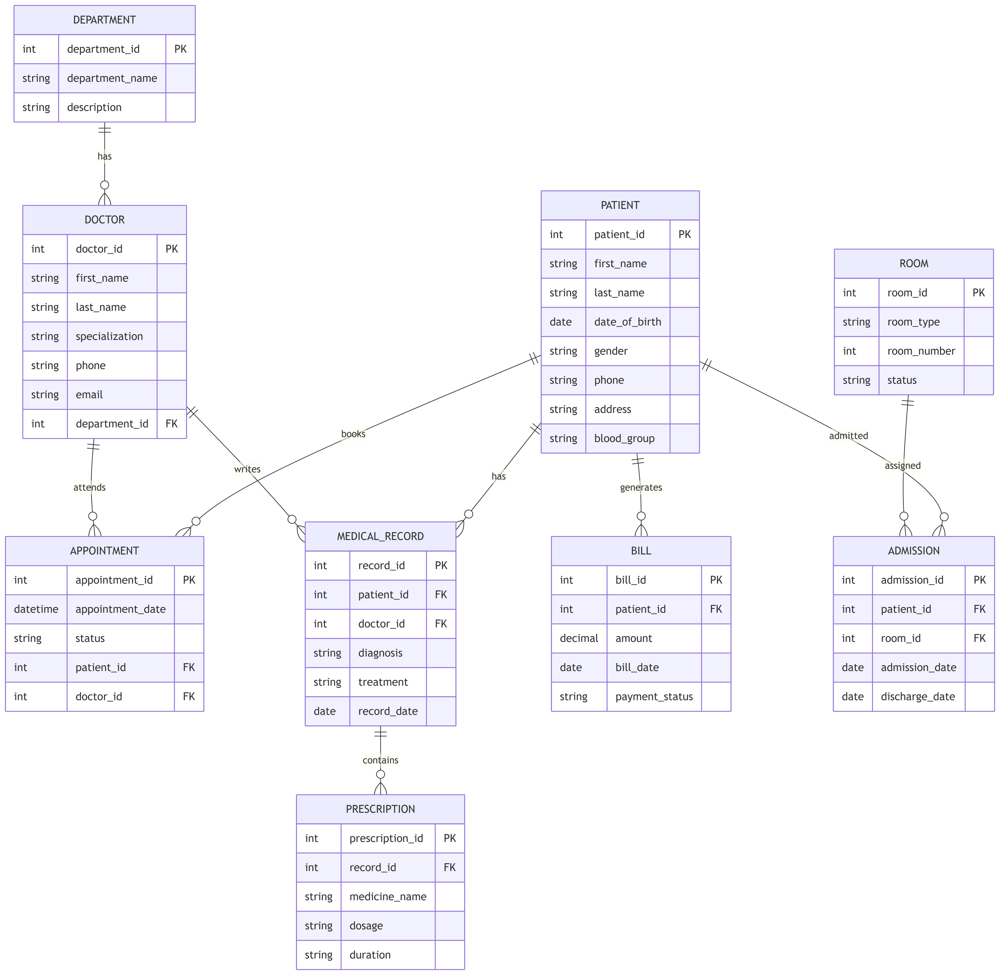

# 🏥 Hospital Management System

## 📌 Overview
This is a **Hospital Management System** built using **Spring Boot** that provides secure and scalable REST APIs for managing hospital operations such as users, roles, and core hospital workflows.

The application follows modern backend best practices including **JWT-based authentication**, **OAuth2 authentication**, and **Role-Based Access Control (RBAC)**.

---

## ERD Diagram

## 🛠️ Tech Stack

- **Java**
- **Spring Boot**
- **Spring MVC (REST APIs)**
- **Spring Data JPA**
- **Spring Security**
- **JWT Token-Based Authentication**
- **OAuth2 Authentication**
- **Role-Based Access Control (RBAC)**
- **PostgreSQL Database**
- **Hibernate ORM**
- **Maven**

---

## 🔐 Security & Authentication

### ✅ JWT Token-Based Authentication
- Stateless authentication using JSON Web Tokens
- Tokens are sent in the `Authorization` header

